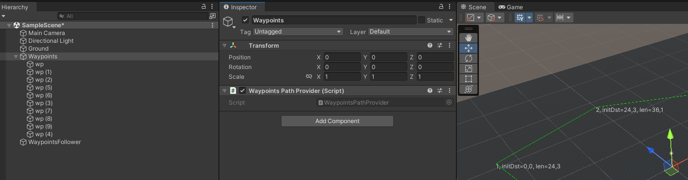
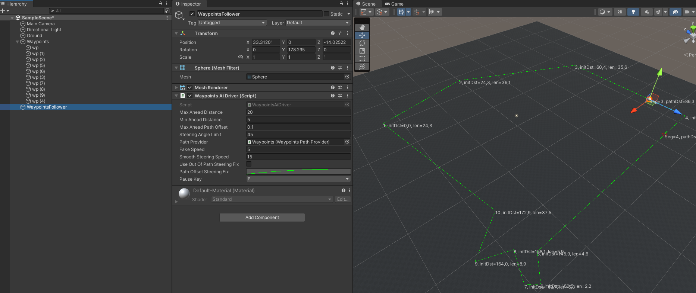
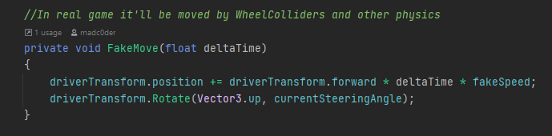

# Waypoints driver

### Build path from waypoints, ordered empty `GameObjects` with only `Transform` component.

**Note:** compatible with Unity 5.6.4+, CarController and Car from Standard Assets included w/o any modifications.

### Package contains scripts for:
- Building path from root `GameObject` which contains several waypoints as a children
- Pre-calculate ahead distance to calculate steering and use it to get current steering angle
- Steering angle is calculated with a fix to control how close Follower will be to path line 

## How to use
1. Create new empty `GameObject` and add several empty children `GameObjects`. 
   It'll be waypoints, order is matter
     
     

2. Add `WaypointsPathProvider` script to the waypoints root
   
     
      
3. Attach `WaypointsAiDriver` script to your "Car" `GameObject`
   
   

4. Update `WaypointsAiDriver` to apply steering to your "Car"
   
   
## `WaypointsAiDriver` params 
Steering is calculated as an angle between following vectors: current Car `transform.forward` 
and direction to **Ahead** point 

- `MaxAheadDistance` - max distance where ahead point can be shifted from Car position along the path
- `MinAheadDistance` - min distance where ahead point can be put
- `MaxAheadPathOffset` - maximum side offset from path to limit ahead scan distance
- `SteeringAngleLimit` - limit of steering angle (i.e. +/- 45 degrees)
- `PathProvider` - reference to `WaypointsPathProvider` component
- `FakeSpeed` - speed of movement of fake Car, you'll ignore it after update the script
- `SmoothSteeringSpeed` - last argument for `Lerp` in calculation of current steering angle
- `UseOutOfPathSteeringFix` - whether use `PathOffsetSteeringFix` or not
- `PathOffsetSteeringFix` - how much to steer to be close to path line
- `PauseKey` - key used to pause the demo